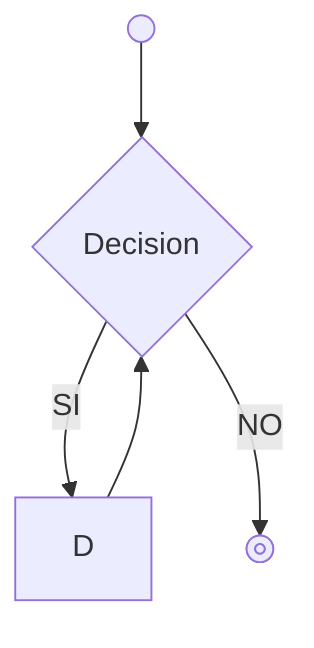
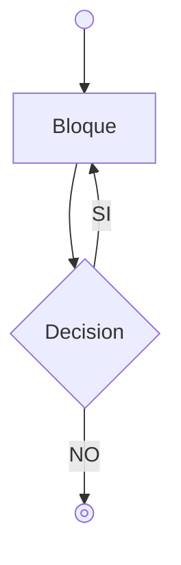

# Bucles
Un bucle es una sentencia que nos permite repetir un número de veces un bloque de código. Existen dos tipos de bucles:
* Bucles indeterminados. Dependen de una condición y no sabemos a priori el número de *iteraciones* que va a hacer
* Bucles determinados. Sabemos el número de repeticiones que queremos hacer.

El uso de un tipo de bucle u otra dependará del contexto donde queremos ejecutarlo 

## Bucle While
El bucle While (o bucle Mientras) es un bucle indeterminado de *precondición*, es decir se verifica la condición al inicio de la ejecución e iterará mientas la condición sea verdadera



```java
while (condicion) {
    // Bloque de código
    // Se ejecutará mientras la condición sea verdadera
    // Podria darse el caso qe no se ejecutara nunca este bloque
}

```
Por ejemplo, queremos ir sumando numeros enteros secuencialmente hasta que el valor sea mayor o igual que 1 millón.

```java
// Valor que servira para guardar la suma de enteros
int acumulado = 0;
// Secuencia de enteros
int indice = 1;
// Mientras no superemos 1 millón acumulado, ejecutaremos el bucle
while (acumulado <= 1_000_000) {
    // Incrementamos acumulado 
    acumulado = acumulado + indice;
    // Sumamos 1 a indice
    indice++;

}
```

## Bucle Do-While




```java
do  {
    // Bloque de código
    // Se ejecutará mientras la condición sea verdadera
    // Este bloque se ejecuta al menos 1 vez
} while (condición)
```


## Bucle For

```java

for (int indice = 0; indice < 10; indice++ ) {
    // Este bloque se ejecuta 10 veces
}

```
