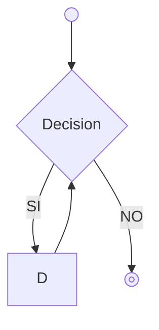
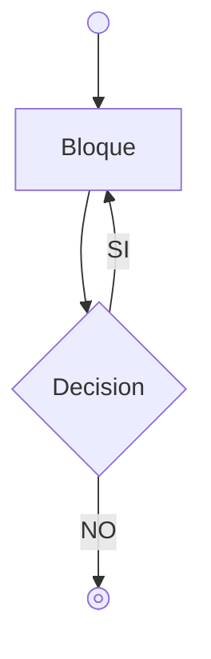

# Bucles
Un bucle es una sentencia que nos permite repetir un número de veces un bloque de código. Existen dos tipos de bucles:
* Bucles indeterminados. Dependen de una condición y no sabemos a priori el número de *iteraciones* que va a hacer
* Bucles determinados. Sabemos el número de repeticiones que queremos hacer.

Cada tipo de bucle es más adecuado para ciertos requisitos.

## Bucle While
El bucle While (o bucle Mientras) es un bucle indeterminado de *precondición*, es decir se verifica la condición al inicio de la ejecución e iterará mientas la condición sea verdadera



```java
while (condicion) {
    // Bloque de código
    // Se ejecutará mientras la condición sea verdadera
    // Podria darse el caso qe no se ejecutara nunca este bloque
}

```
Por ejemplo, queremos ir sumando numeros enteros secuencialmente hasta que el valor sea mayor o igual que 1 millón.

```java
// Valor que servira para guardar la suma de enteros
int acumulado = 0;
// Secuencia de enteros
int indice = 1;
// Mientras no superemos 1 millón acumulado, ejecutaremos el bucle
while (acumulado <= 1_000_000) {
    // Incrementamos acumulado 
    acumulado = acumulado + indice;
    // Sumamos 1 a indice
    indice++;

}
```

## Bucle Do-While
El bucle do-while es el otro bucle indeterminado. A diferencia del bucle *while* la condición se verifica despues de que se ejecute el bucle.




```java
do  {
    // Bloque de código
    // Se ejecutará mientras la condición sea verdadera
    // Este bloque se ejecuta al menos 1 vez
} while (condición)
```


## Bucle For

En **Java** el bucle determinado se llama bucle *for*, su sintaxis es la siguiente:

```java

for (int indice = 0; indice < 10; indice++ ) {
    // Este bloque se ejecuta 10 veces
}

```
Repasemos las partes que tiene:

```java
// Declara la variable indice y la inicia a 0. ¡La variable indice sólo es visible en el bucle!
int indice = 0;
// Condición de finalización. Se evalua cada vez que se comienza una iteración: si es verdadera se ejecuta la iteración, si es falsa se termina la ejecución
indice < 10;
// Paso. Indicamos en cuanto queremos avanzar el indice al finalizar la iteración. Normalmente daremos un sólo paso, pero podemos indicar un paso diferente
indice++; 

```
## Bucles anidados

Una construcción muy común es la de anidar un bucle dentro de otro. Es decir, ejecutamos un bucle que en su cuerpo tiene otro bucle. Hay que ser cautelosos con este tipo de ordenación de código ya que puede aumentar mucho la complejidad de nuestro código.

```java

// Suponemos que queremos recorrer los 7 dias de una semana y las 6 horas de clase
for (int dia=1; dia<=7; dia++) {
    for (int hora=1; hora<=6; hora++) {
        // Hacemos algo
    }
}

```
Estos bucles anidados hara que el código del bloque se ejecute $6*7$ veces, por lo que podemos ver lo rapido que aumenta el número de iteraciones.
