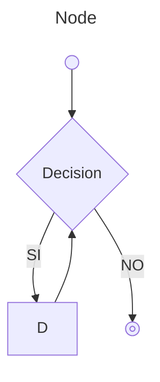

```mermaid
---
title: Node
---
flowchart TD

    A@{ shape: sm-circ, label: "Small start"  }
    A e@--> C
    C@{ shape: diamond, label: "Decision" }
    C -- SI --> D
    C -- NO --> Z
    D --> C
    D@{shape: rect,label:"Bloque loop"}
    Z@{ shape: framed-circle, label: "Stop" }

```
