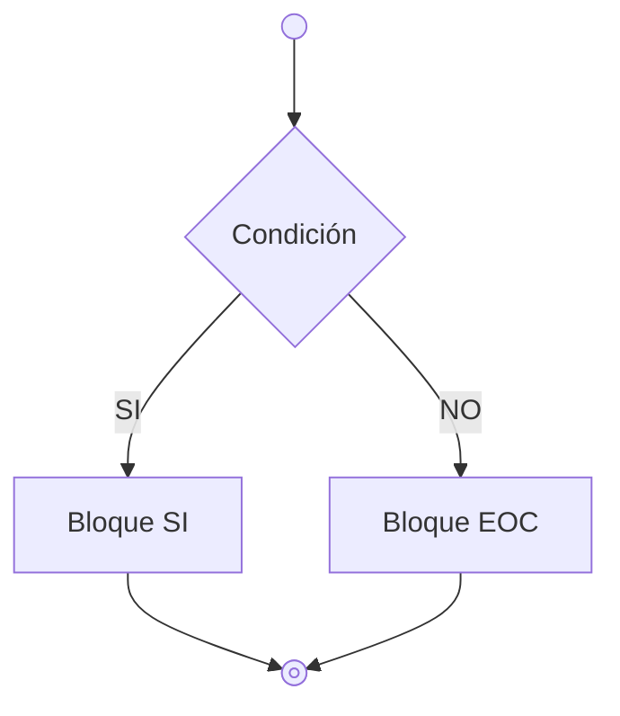
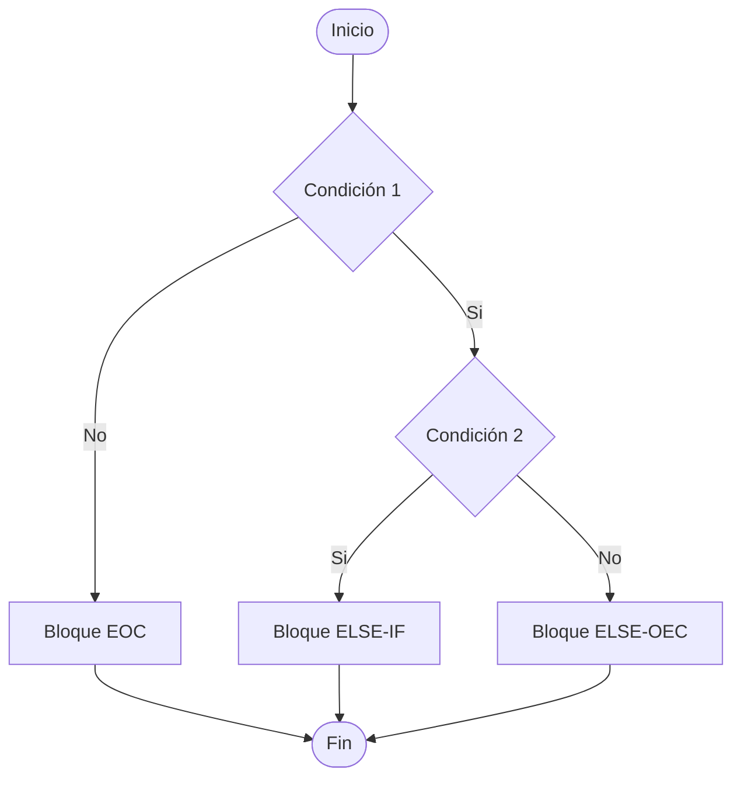
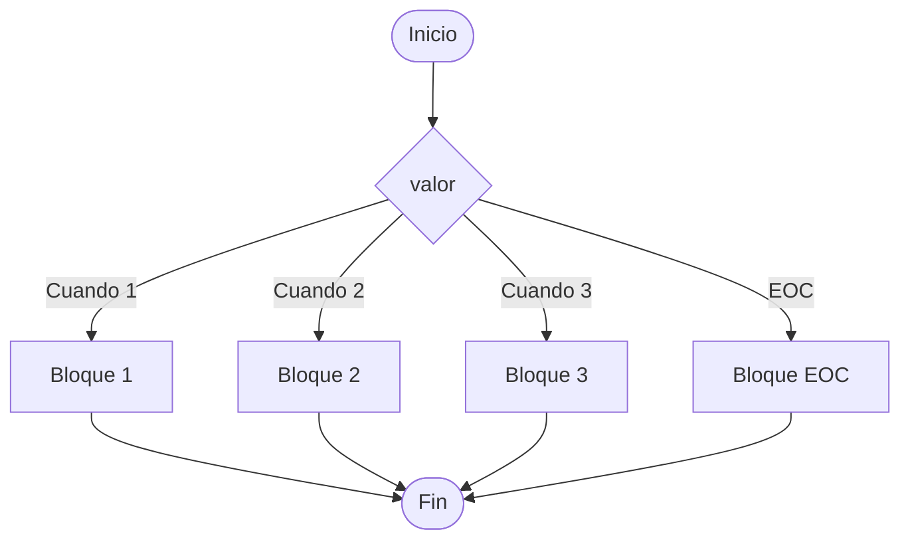

# Sentencias Condicionales
Hasta ahora los programas que hemos ido desarrollando tienen una estructura **secuencial**: cada una de las instrucciones se ejecuta detras de otra hasta que el programa termina. Sin embargo, no tenemos la posibilidad de cambiar el *flujo de ejecución del programa* en función de otras condiciones. Es por ello, que en este tema introduciomos las sentencias condicionales: instrucciones que nos permiten ejecutar partes del código en función de condiciones lógicas.

## Sentencia SI
La sentencia SI existe en casi todos los lenguajes de programación. Nos sirve para ejecutar un bloque de código si se cumple una condición o ejecutar otra bloque en caso contrario.

La sentencia si en Java se llama if y esta es su sintaxis:
```java
if (condicion) {
    // Bloque Si
}
else {
    // Bloque EOC
}
```
### Sentencia IF-ELSEIF
La sentencia IF-ELSE-IF nos permite añadir una condición adicional a la hora de ejecutar el caso negativo:

```java
if (condicion) {
    // Bloque Si
}
else if (condicion2) {
    // Bloque ELSE-IF
} 
else {
    // BLoque ELSE
}
```

## Sentencia Cuando
En realidad es una generalización de la sentencia SI, ya que en lugar de tener dos posiblidades de salida, la sentencia cuando tenemos una rango de posiblidades.


### Sentencia Cuando en Java
Lo siguiente es la sintaxis de Cuando en Java, la sententecia Switch
```java
switch (variable) {
    case valor1: // Bloque 1
        break;
    case valor2: // Bloque 2
        break;
    case valor3: // Bloque 3
       break;
    default: // Bloque EN OTRO CASO
}

// A partir de Java 14 podemos usar la sintaxis mejorada
switch (variable) {
    case valor1 -> { 
        // Bloque 1
    }
    case valor1,valor2,valor3 -> {
        // Bloque 2
    }
    default -> {
        // Bloque En otro caso
    }
}
```
## Sentencias anidadas
Llamamos anidamiento a la construcción de sentencias *if* dentro de otras sentencias *if*. 
Las estructuras condicionales pueden anidarse, es decir, se pueden incluir if, else if, else o switch dentro de otros bloques condicionales.
Por ejemplo:
```java
if (condicion) {
    if (otra_condicion) {
        // SOLO SE EJECUTA SI CONDICION y OTRA_CONDICION SON VEERDAERS
    }
    else {
        // SE EJECUTA SI CONDICION ES VERDADERA y OTRA_CONDICION ES FALSA
    }
}
else {
    // SE EJECUTA SI CONDICION ES FALSA
}
```
## Consejos y buenas prácticas
1. **Leer siempre la condición completa:** Asegúrate de que las condiciones sean claras y fáciles de entender.
2. **Evitar anidación profunda:** Anidar muchas estructuras condicionales puede hacer que el código sea difícil de leer. En estos casos, es mejor considerar otras soluciones, como usar switch o refactorizar el código en funciones.
3. **Uso de default en switch:** Aunque no es obligatorio, es una buena práctica incluir un bloque default para manejar casos inesperados.
4. **Operador ternario con moderación:** Si bien el operador ternario puede hacer el código más compacto, su abuso puede hacerlo menos legible.
5. **Uso de múltiples valores en case:** Aprovecha la capacidad de agrupar múltiples valores en un solo case para reducir redundancias y mejorar la claridad.
6. **Consistencia en la sintaxis de switch:** Decide si utilizar la sintaxis clásica con break o la sintaxis mejorada con -> y mantén la consistencia en todo tu código.


