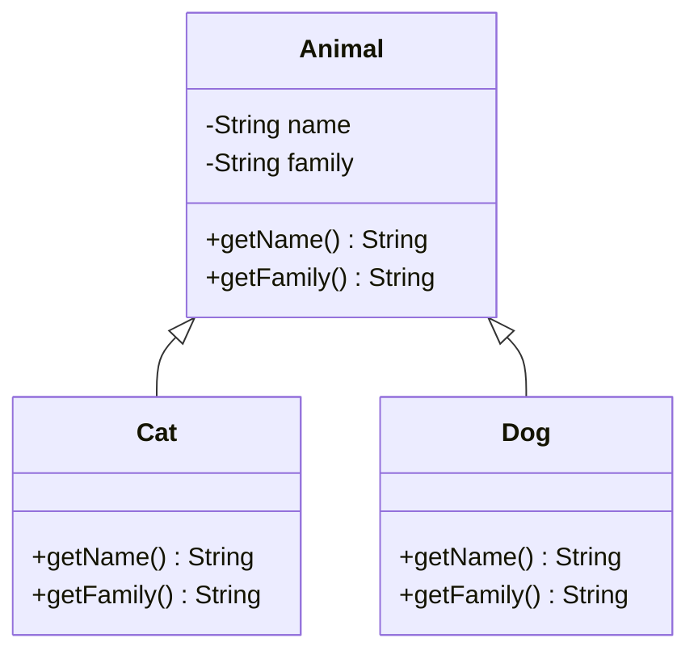

# Introducción a la programación orientada a objetos
## Definiciones
### Paradigmas de programación
Se denominan paradigmas de programación a las formas de clasificar los lenguajes de programación en función de sus características. Los idiomas se pueden clasificar en múltiples paradigmas.

Algunos paradigmas se ocupan principalmente de las implicancias para el modelo de ejecución del lenguaje, como permitir efectos secundarios o si la secuencia de operaciones está definida por el modelo de ejecución. Otros paradigmas se refieren principalmente a la forma en que se organiza el código, como agrupar un código en unidades junto con el estado que modifica el código.

#### Programación orientada a objetos

La programación orientada a objetos (POO) es un paradigma de programación que parte del concepto de "objetos" como base, los cuales contienen información en forma de campos (a veces también referidos como atributos, cualidades o propiedades) y código en forma de métodos.
### Clase
Una clase es una plantilla para el objetivo de la creación de objetos de datos según un modelo predefinido. Las clases se utilizan para representar entidades o conceptos, como los sustantivos en el lenguaje. Cada clase es un modelo que define un conjunto de variables y métodos apropiados para operar con dichos datos. 
### Objeto
En los lenguajes de programación orientada a objetos un objeto es una instancia de una clase. Esto es, un miembro de una clase que tiene atributos en lugar de variables. En un contexto del mundo real, podríamos pensar en "Casa" como una clase y en un chalet como una instancia de esta e incluso otro chalet u otro tipo de casa como puede ser un apartamento como otra instancia.
### Atributo
Contenedor de un tipo de dato asociado a un objeto, que hace los datos visibles desde fuera del objeto y esto se define como sus características predeterminadas, y cuyo valor puede ser alterado por la ejecución de algún método.
#### Atributo de clase
Es un valor propio de la clase, por lo que todos los objetos lo comparten
#### Atributo de instancia
Es un valor propio de cada objeto, por lo que dos objetos diferentes pueden tener valores diferentes.
### Constructor
Un constructor es una subrutina cuya misión es inicializar un objeto de una clase. En el constructor se asignan los valores iniciales del nuevo objeto.
### Método
Un método es una subrutina cuyo código es definido en una clase y puede pertenecer tanto a una clase, como es el caso de los métodos de clase o estáticos, como a un objeto, como es el caso de los métodos de instancia.
Podemos considerar al método como el pedido a un objeto para que realice una tarea determinada o como la vía para enviar un mensaje al objeto y que este reaccione acorde a dicho mensaje.
### Herencía
La herencia facilita la creación de objetos a partir de otros ya existentes e implica que una subclase obtiene todo el comportamiento (métodos) y finalmente los atributos (variables) de su superclase.

```mermaid
F
classDiagram
class Padre {
    +int atributo
    +metodo()

}

class Hija {
    +int atributo
    +metodo()

}

Padre <|-- Hija

```

## Programación orientada a objetos en Java
### Sintaxis de clase
```java
public class Cat {
    // Atributos de clase
    public static int catsBorn = 0;
    // Atributos de instancia
    public int age;
    public String name;
    public int pawsNumber;
    private boolean isAwake;
    // Constructores
    publ(ic Cat(int age, String name) {
        this.age = age;
        this.name = name;
        this.pawsNumber = 4;
        this.isAwake = true;
        catsBorn++;
    }
    // Métodos
    public void sleep() {
        this.isAwake = false;
    }

    public void awake() {
        this.isAwake = true;
    }

    public void meow() {
        if (this.isAwake) {
            System.out.println("Meow!");
        }
        else {
            System.out.println("ZZz... Zzz...");
        }
    }
}
```
### Creación de objetos
```java
Cat garfield = new Cat(6,"Garfield");
```
### Acceso a atributos
```java
if (garfield.pawsNumber != 4) {
    System.out.println("This cat is missing a paw!");
}
else {
    System.out.println("Just a regular cat named " + garfield.name);
}
```
### Invocación de métodos
```java

garfield.sleep();
garfield.meow();
> ZZz... Zzz...

garfield.awake();
garfield.meow();
> Meow!

System.out.println(Cats.catsBorn);
> 1
```
### Herencía

**Java** soporta la herencia simple: una clase puede heredar unicamente de una clase padre.

Veamos un ejemplo: 

```java

public class Animal {
    private String name;
    private String family;

    public Animal(String name) {
        this(name,"Unknown"); // Llamamos al segundo constructor
    }
    public Animal(String name, String family) {
        this.name = name;
        this.family = family;
    }

    public String getName() {
        return this.name;
    }
    public String getFamily() {
        return this.family;
    }
}
// Decimos que gato es una especie de animal
public class Cat extends Animal {

    public Cat(String name) {
        // Llamaos a un constructor de la clase padre
        // Sabemos que los gatos son de la familia Felidae!
        super(name,"Felidae");
    }
    // Este gato no sabemos el nombre, pero siempre serña felidae
    public Cat(){
        super("Unknown","Felidae");
    }

}
// Perror también hereda de Animal
public class Dog extends Animal {
    public Dog(String name) {
        super(name,"Canidae");
    }
}

```


